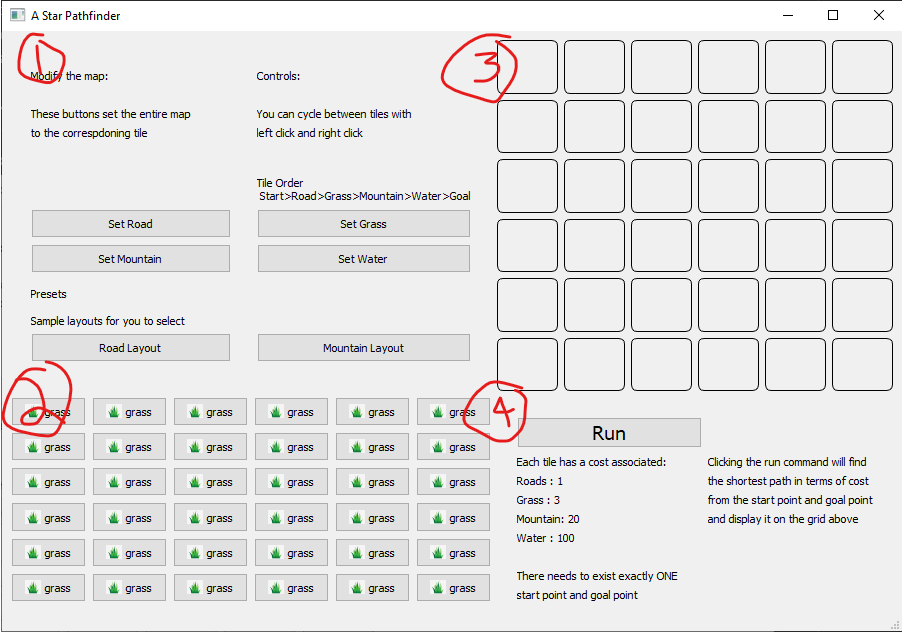
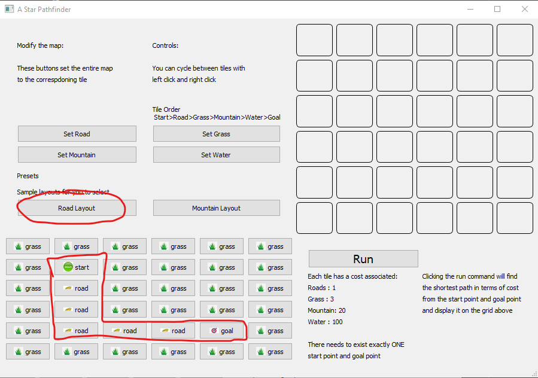
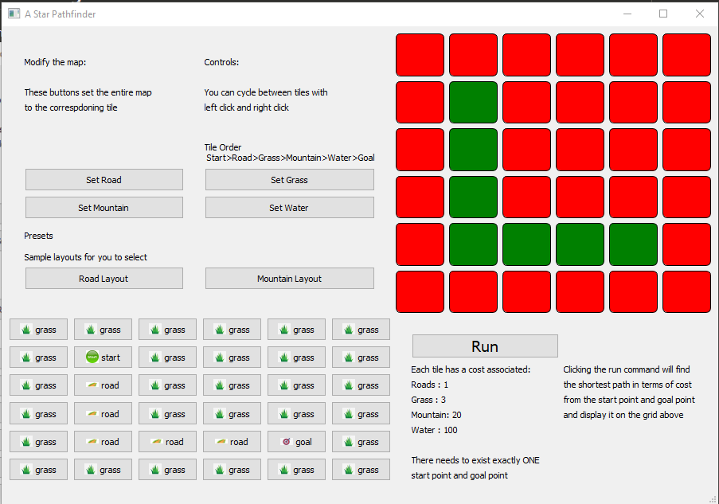

# A* Pathfinder Application

This directory houses the source code for an A Star Pathfinding application. It will briefly go 
over,where to get it, how to use the application, and the logic behind the A Star algorithm.

## Download and Acquiring the application
You can download the executable by clicking on the releases tab. It will contain the source
code of all the other directions as well in addition to the executable. You can follow
this link here as well (https://github.com/cxiong1/demos/releases). You can find the 
executable itself in the assets section of the release

## Tutorial and user guide

Upon first launching the application you should be greeted with a screen that looks like this.
The screen has been marked with 4 numbers and their respective purpose will be 
explained below.

The application is split up into 4 sections.

1. Utility and tile manipulation - This section allows the user to easily set all the tiles 
on the board to the corresponding tile. There are also two preset buttons which give an example
layout on the board.

2. Tile Grid - This grid of buttons all the user to manually designate the cost and feature
of each tile. The user can use left click and right click the cycle forwards and backwards
to a specific tile he wants. 

The cycling will go in the order of Start -> Road -> Grass -> Mountain -> River -> Goal

The the loop is circular so you can transition between Goal -> Start and in the reverse
as well if you right click from Start back to Goal

3. Display Area - After the user has clicked the run button in section 4, the display area
will update with a graphical interface showing the optimal path from the designated starting 
point and the designated goal point. 

4. Run button - This buttons executes the A Star Logic and updates 3. Display Area to show 
an optimal path from the start and goal point

### Road Layout Example

As an example, we will use the road layout preset and have the application perform an A Star
pathfind on it.

By clicking the Road Layout button in 1. Utility, we can load in a preset layout. Notice how the board in 
2. Tile Grid updates. 

After the board has been configured into our desired state, we can continue and click the Run button in. By doing so,
we tell the program to start calculating the optimal path from the start point and goal point. Notice that the optimal path 
is not always the shortest in term of number of tiles traversed. Because each tile has a cost associated, some times 
it may be more advantageous to take a longer path that consists of tiles with a lower cost. However, in this example,
the optimal path is also the shortest path available.

Below is what the screen should look like after the Run button has been clicked. 3 Display Area should update with
graphics that display the optimal path. Green tiles means that is the suggested path. All other tiles which are irrelevant
to the path are marked as Red

